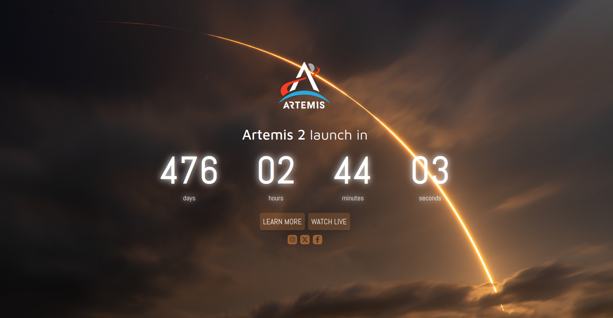

# Artemis Program Launch Countdown

This project is a simple countdown webpage built using React and Tailwind CSS to display the time remaining until the next Artemis program launch (Artemis 2), scheduled for September 2025. Please note that the launch date is not confirmed and subject to change. The last time the launch date was updated in the code was April 11st 2024.

## 🖼️ Preview

You can see the live demo of this project [here](https://albert-rafa.github.io/artemis-countdown/)

## 🛠️ Technologies Used

- React
- Tailwind CSS
- TypeScript

## 📂 Project Structure

The project structure is as follows:

- `public/`: Contains other static assets.
- `src/`: Contains the React components and styles.
  - `components/`: Contains reusable React components.
  - `assets/`: Contains the images used.

## 🤝 Contributing

Contributions to improve this project are welcome! If you find any issues or have suggestions for enhancements, please open an issue or submit a pull request.

## 📝 License

This project is licensed under the [MIT License](LICENSE).